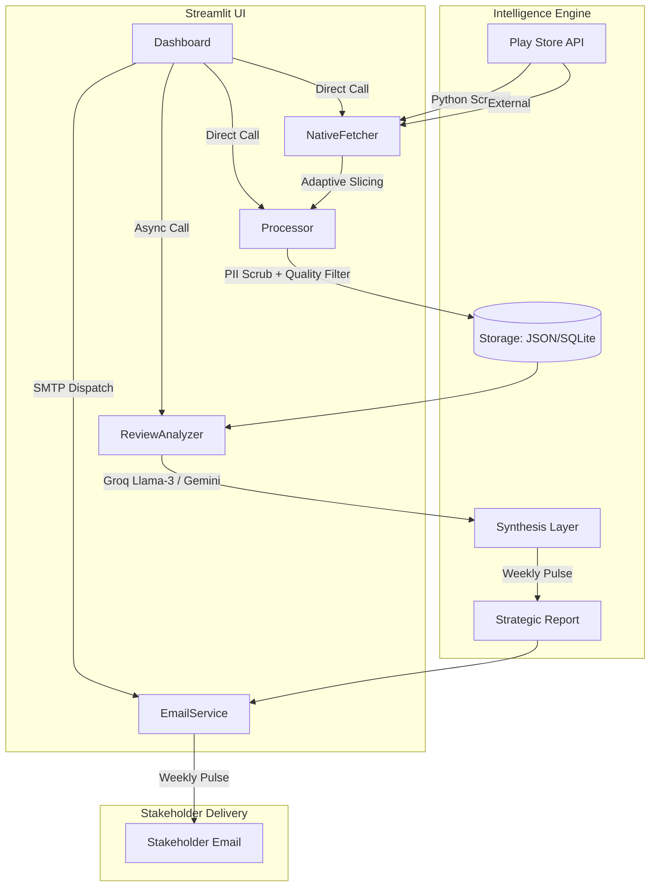

# INDmoney Pulse - System Architecture (Streamlit Native)

## System Overview
The App Insight Analyser (branded as **INDmoney Pulse**) is a high-performance, AI-driven command center for monitoring and synthesizing user sentiment for the INDmoney mobile app. It has been re-architected into a standalone, pure Python implementation for maximum speed and deployment efficiency on Streamlit Cloud.

## Component Breakdown

### 1. Native Fetcher (Data Acquisition/Phase 1)
- **Technology**: `google-play-scraper` (Python library).
- **Strategy**: Uses **Adaptive Slicing**. Instead of broad multi-source fetching by default, it targets the specific `limit` requested by the user, falling back to multiple sorts only if necessary.
- **Latency**: Reduced from several minutes (Node.js subprocess) to seconds (native Python).

### 2. Intelligent Processor (Phase 2)
- **Signal Filtering**: 
    - **Language**: Stricter heuristic English detection using common function words.
    - **Quality**: Discards reviews with < 4 words unless they contain critical signals (crash, bug, failed).
    - **Deduplication**: In-memory cozy-matching for redundant feedback signals.
- **PII Scrubbing**: Native Python regex for rapid redaction of emails, phone numbers, and identifying data.

### 3. Analysis Engine (Phase 3 & 4)
- **Large Language Models**: Powered by **Groq (Llama-3)** with a high-speed **Gemini 1.5 Flash** fallback.
- **Synthesis Logic**: Generates an "Executive Pulse" with 3 top themes, user verbatim quotes, and 3 strategic product recommendations.
- **Reliability**: Uses a lazy-initialization pattern to prevent dashboard crashes if API keys are temporarily unavailable.

### 4. Stakeholder Dispatch (Email Service)
- **Technology**: `aiosmtplib` (Async SMTP).
- **Capability**: Generates branded, distraction-free HTML reports and dispatches them directly from the dashboard UI.

## Deployment Strategy
- **Platform**: Streamlit Cloud.
- **Environment**: Managed via `requirements.txt` and `runtime.txt` (Python 3.11).
- **Secrets**: API keys and SMTP credentials managed through the Streamlit Cloud "Secrets" dashboard (TOML format).

## Data Flow (Streamlined)
1. **Trigger**: User sets a "Threshold" and "Range" in the Sidebar.
2. **Fetch**: Native fetcher retrieves the exact slice of data directly into memory.
3. **Clean**: Processor scrubs and filters high-signal reviews.
4. **Analyze**: AI engine synthesizes trends into a structured report.
5. **View**: Dashboard updates instantly with themes and quotes.
6. **Delivery**: Optional one-click email dispatch to stakeholders.

---
*Note: This architecture replaces the legacy 6-phase Node.js pipeline with a modern, single-process Python implementation.*
